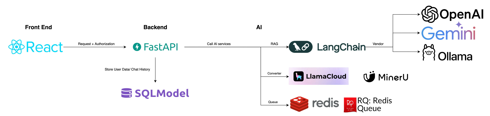

# RAG Research Project 📑🤖
*Authors:Trang Nguyen Anh Thuan & Tran Son Phat.*

## About

This repository contains the code for basic RAG system.

## Overview

### Features
- End-to-end RAG system with PDF conversion, text chunking, retrieval, and interactive chat capabilities
- Queue system for PDF conversion with Redis RQ Dashboard monitoring
- Support for both cloud-based (OpenAI, Gemini) and self-hosted (Ollama) LLM models
- Support for both cloud-based (LlamaParse) and self-hosted (MinerU) PDF converters
- User authentication system with separate admin and user roles:
  - Admins can manage PDF files
  - Users can interact with the RAG chatbot

### Diagram


### Demo

**Chat RAG**


**User Login/Change Password**


**Admin Login/Upload/Delete**


## How to run

### Step 1: Setup the environment

Create a folder called ```data``` in the root folder. In that folder:
- Create ```data/pdfs``` and place your PDF files in that folder.
- Create ```data/markdowns``` that contains ```data/markdowns/images``` and ```data/markdowns/text``` to save the result
of markdown converter.
- Create ```data/vector_store``` to save the text chunks

```
 |-ai
 | |-data
 | | |-markdowns
 | | | |-text
 | | | |-images
 | | |-vector_store
 | | |-pdfs
```

Change ```.env_sample``` to ```.env``` and add your API keys and adjust config to suit your needs

Create virtual environment and install dependencies 
```bash
pip install -r requirements.txt
```

### Step 2: Convert PDFs to Markdown files

#### MinerU:
For the converter step, we use the MagicPDF package from MinerU. First, you should start by running the set-up file in
the script folder. This will create the ```magic-pdf.json``` config file and download relevant OCR/Deep Learning models
for the package to function properly.

```bash
python scripts/magic_pdf_setup.py
```

Then replace all the paths in ```markdown_converter/__init__.py``` folder with your appropriate paths.
Finally, from the root folder, run
```bash
python markdown_converter/__init__.py
```
to convert all the PDF files to Markdown files.

#### LlamaParse:
Add ```LLAMA_CLOUD_API_KEY``` to the ```.env``` file.

### Step 3: Run the web application
```
# backend
RAG-Research-Project/backend$ python app.py

# ai
RAG-Research-Project/ai$ python app.py

# chroma 
RAG-Research-Project/ai$ python run_chroma.py

# redis 
RAG-Research-Project/ai$ python run_worker.py

# rq worker
RAG-Research-Project/ai$ python run_worker.py --name convert
```
